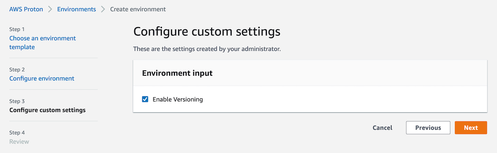

# proton-terraform-s3-bucket

A demo AWS Proton Terraform template that creates an S3 bucket.

## Usage

- Fork (or clone/copy) this repo
- Create a new Proton Environment Template using Git Sync pointed at your repo copy
- For the Template Name, choose, `s3-bucket` (which matches the directory name in this repo)
- Create a new Proton Environment based on Environment Template.  The GUI should look like the following.

